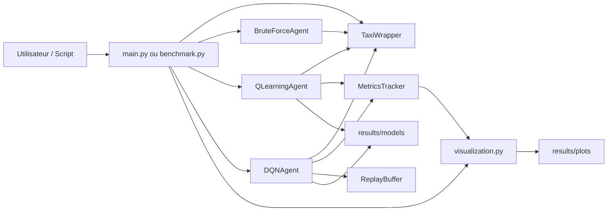

# Architecture Technique

## Vision globale

Le projet est organise en couches:

- `environment/`: interface Gymnasium (`TaxiWrapper`)
- `agents/`: algorithmes d'apprentissage
- `utils/`: metriques, visualisation, replay buffer, replay console
- `main.py` et `benchmark.py`: orchestration



## Organisation des fichiers

```text
TaxiDriver/
  src/
    agents/
      brute_force.py
      q_learning.py
      dqn.py
    environment/
      taxi_wrapper.py
    utils/
      metrics.py
      replay_buffer.py
      replay.py
      visualization.py
    config.py
    main.py
    benchmark.py
  scripts/
  results/
  report/
  Docs/
```

## Responsabilites par module

- `src/environment/taxi_wrapper.py`
  - Encapsule `Taxi-v3`
  - Gere le reward shaping (`default`, `distance`, `custom`)
  - Expose `reset`, `step`, `render`, `decode_state`

- `src/agents/brute_force.py`
  - Politique aleatoire
  - Sert de baseline de comparaison

- `src/agents/q_learning.py`
  - Q-table `(n_states x n_actions)`
  - Politique epsilon-greedy
  - Sauvegarde/chargement `.pkl`

- `src/agents/dqn.py`
  - Reseau de neurones `QNetwork`
  - `ReplayBuffer` pour decorrelation des transitions
  - `target_net` synchronise periodiquement
  - Sauvegarde/chargement `.pt`

- `src/utils/metrics.py`
  - Suivi episode par episode
  - Stats agregees et rolling means

- `src/utils/visualization.py`
  - Graphiques d'analyse (courbes, boxplots, heatmaps, tableaux)

- `src/utils/replay.py`
  - Affichage console unifie des episodes rejoues

- `src/config.py`
  - Constantes partagees (`TEST_SEED`, `N_TEST_EPISODES`, `OPTIMIZED_PARAMS`)
