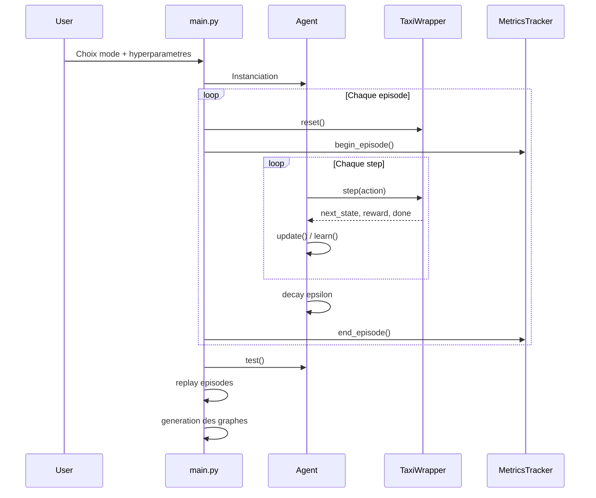
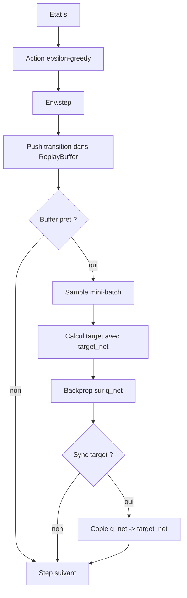
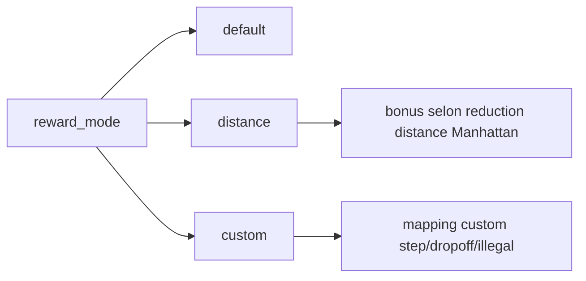

# Flux D'execution

## 1) Entrainement standard (`main.py`)



## 2) Boucle Q-Learning

```mermaid
flowchart TD
    S[Etat s] --> A[Choix action a epsilon-greedy]
    A --> E[Env.step(a)]
    E --> R[Recoit r, s']
    R --> U[Mise a jour Bellman]
    U --> D{done ?}
    D -- non --> S
    D -- oui --> EP[Fin episode + decay epsilon]
```

Formule:

```text
Q(s,a) <- Q(s,a) + alpha * [r + gamma * max_a' Q(s',a') - Q(s,a)]
```

## 3) Boucle DQN



## 4) Reward shaping dans `TaxiWrapper`



## 5) Generation de resultats

1. Les agents produisent des `MetricsTracker`.
2. `visualization.py` transforme les metriques en figures PNG.
3. Les figures sont enregistrees dans `results/plots/`.
